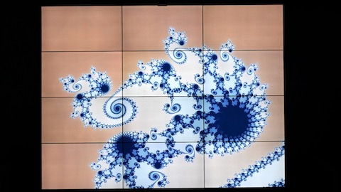
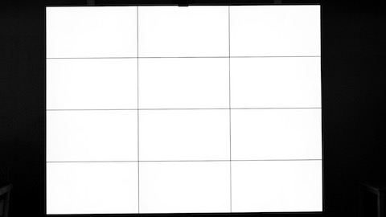

# Interactive Visualization using Tiled Display Systems and Multiple GPUs

This repository contains experimental code for the interactive visualisation of GPGPU computed data (in particular network layouts) using tiled display systems. Obtaining the frame rates that are required for interactive use at the high resolutions of tiled display systems is a primary goal of this project. To this end it supports visualizing the GPGPU computed data 'in situ', by sharing the (physical) memory allocated for compute and render tasks on each GPU. This project was developed at the [Leiden Institute of Advanced Computer Science (LIACS)](https://liacs.leidenuniv.nl) using _BigEye_, a 12-display tiled-display system equipped with three NVIDIA GPUs. 
See [porting to other systems](#porting) for additional information about using the framework on other (Linux based) tiled display systems that have NVIDIA GPUs.

Detailed information on the design and methodology of the system is available in:
* G.G. Brinkmann, [K.F.D. Rietveld](https://liacs.leidenuniv.nl/~rietveldkfd), [F.J. Verbeek](https://www.universiteitleiden.nl/en/staffmembers/fons-verbeek) and [F.W. Takes](https://liacs.leidenuniv.nl/~takesfw), [Real-time interactive visualization of large networks on a tiled display system](https://doi.org/10.1016/j.displa.2022.102164), _Displays_, vol. 73, 2022. 

#### Citing
To cite this software, please use the aforementioned reference, or the `preferred-citation` section in [CITATION.cff](./CITATION.cff). The latter can be converted to the desired format using [various tools](https://github.com/citation-file-format/citation-file-format#tools-to-work-with-citationcff-files-wrench), or using _Cite this repository_ in the _About_ section of [this project's GitHub page](https://github.com/govertb/TiledMultiGPUVisualization).

_BigEye_, the tiled-display system used for our experiments 

## Subprojects
Three subprojects are available in this repository: `netvis`, `mandelbrot` and `template`:

Project                            | Summary                                                                   | Preview 
---------------------------------- | -------------------------------------------------------------------------------------------------------------------- | -------------------------------------------------
[`./netvis`](./netvis)             | Multi-GPU network visualization (ForceAtlas2), each graphics card renders the part of the layout it displays.        | 
[`./mandelbrot`](./mandelbrot)     | Multi-GPU Mandelbrot visualization, each graphics card computes and 'renders' the part of the fractal it displays.    | 
[`./template`](./template)         | Application agnostic code shared between `netvis` and `mandelbrot`. Provided as illustration/pseudocode, not tested. | 

Finally, the [`./misc`](./misc) folder contains miscellanious scripts used to perform benchmarks as well as the configuration files used for _BigEye_. 

### Interactive visualization

All projects implement a basic event loop that captures the keyboard/mouse events, and use these to implement basic interactions. We included our config files for XWiMote at  [`./misc/config`](./misc/config), which we used to interact with the visualizations using a WiiMote. Some videos demonstrating this can be found at <a href="https://govertbrinkmann.nl/tiledvis/videos" target="_blank">https://govertbrinkmann.nl/tiledvis/videos</a>.

### Porting to other systems
Each of the subprojects should be portable to other tiled display systems. Be aware that the project currently assumes the physical layout of the X Screens to match that of BigEye, see e.g.  [`./template/tiled_visualization.cu:70`](./template/src/tiled_visualization.cu#L70).

### License
Most of the source files for this project are released under the GNU Affero General Public License. The license notice in each file provides more information. A copy of the GNU Affero General Public License can be found in the `LICENSE` file for each subproject.

### Disclaimer
This program is distributed in the hope that it will be useful, but WITHOUT ANY WARRANTY; without even the implied warranty of MERCHANTABILITY or FITNESS FOR A PARTICULAR PURPOSE. See the GNU General Public License for more details.
