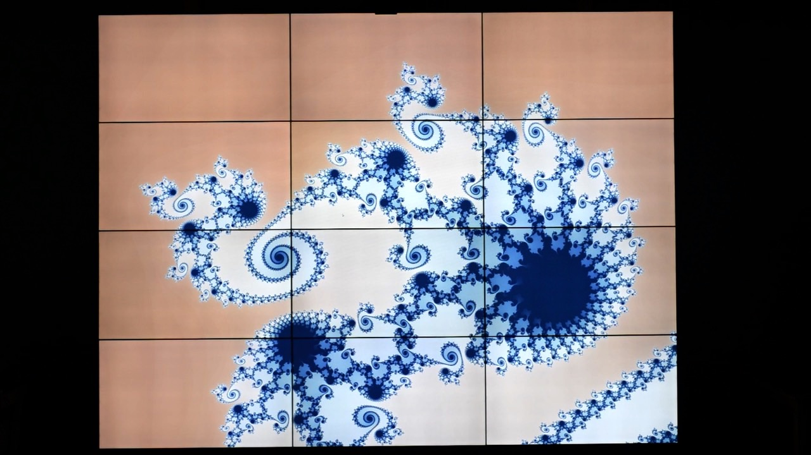

Mandelbrot Visualization on Tiled Display Systems
=================================================================

#### Description
Visualize the Mandelbrot set. Each GPU in the system computes and 'renders' the part of the Mandelbrot set to be displayed on the monitors attached to it. 

#### Compilation
1. The code depends on a git submodule (`lib/colormap`). Run
   `git submodule init` and `git submodule update`
   to make sure this is checked out before compiling.
2. Run `./build.sh` to compile all code.

#### Running
Disable Xinerama for optimal performance:
1. Edit the X configuration file
   (`/etc/X11/xorg.conf`), changing `Option "Xinerama" "1"` to
   `Option "Xinerama" "0"`. If the former option isn't present, add the latter.

2. After changing the configuration, restart X for the changes to take effect
  using `sudo systemctl restart lightdm`.

Run `./mandelbrot gui` to start the visualization. Use the mouse to
navigate using drag/scroll interactions.

#### Using the WiiMote

`XWiimote` should be configured on BigEye, so binding the WiiMote should
be enough to use it as the input device. If `XWiiMote` is not installed or confiugred, see [install XWiimote](#install_xwiimote).

To bind the WiiMote,
1. Position the WiiMote in front of middle column of displays
   (for calibration) at a distance of approximately 2m, pointed towards
   the displays.

2. Put the WiiMote in binding mode (by holding the 1+2 buttons for some
   seconds). The LEDs will blink.

3. Bind the WiiMote via the Bluetooth menu (topright of the display).

#####  Controls
Interaction using the WiiMote is through keyboard/mouse simulation.

- `B button` : left-mouse
- `+/- buttons`: zoom in/out.
- `home button`: reset view.

Navigating around the fractal is possible by dragging the mouse. The mouse
follows the position pointed to by the WiiMote and the button on the back
of the WiiMote functions as the left mouse button. Navigate through
click-drag-release interactions.

#### Installing and configuring XWiiMote

1. Ensure the `hid-wiimote` kernel module is installed (should be
   included with recent Linux kernels) and loaded (e.g. by adding it to
   `/etc/modules` or by using `modprobe`).

2. Install XWiiMote and the corresponding X input driver. For Ubuntu:
   `sudo apt install xwiimote xserver-xorg-input-xwiimote`.

3. Update the configuration of the input driver
   (`/usr/share/X11/xorg.conf.d/60-xorg-xwiimote.conf`) according to the
   [`xwiimote.conf` file](../misc/conf/xwiimote.conf).

#### Possible issues

> The mouse movements produced by WiiMote aren't fluid.

Check that the batteries are charged sufficiently (> 50%) or move closer
to the display/Bluetooth receiver.

> The mouse movements using the WiiMote are completely
  random / uncontrollable.

Try rebinding the WiiMote after disconnecting through the Bluetooth menu
(top-right of the display).
